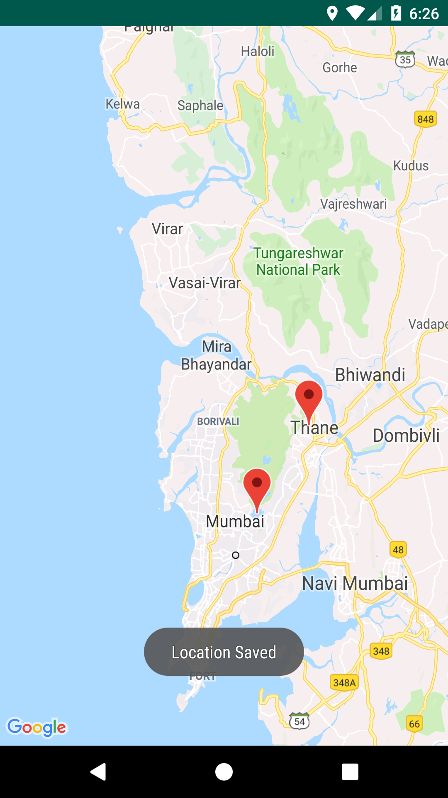
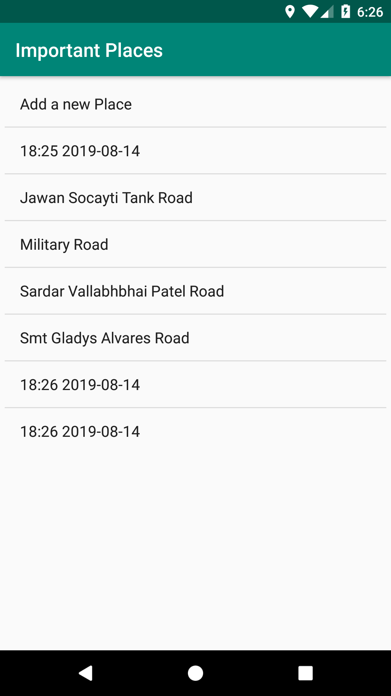

# ImportantPlaces
An android application made using Google Map API to save important place and showing in listview.

**Third party API used:**
  
  * [Google Map API](https://developers.google.com/maps/documentation/javascript/get-api-key)

**Here are the screenshots:**

